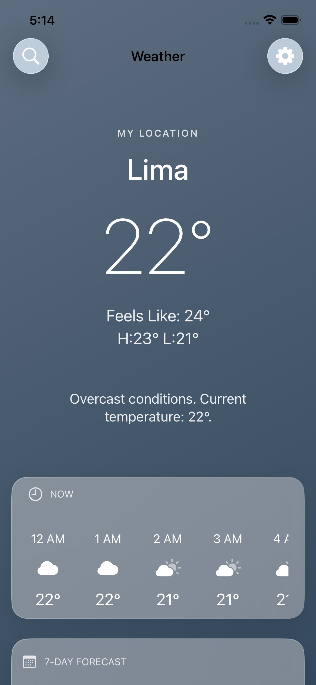

# GitHub Publish Checklist ✅

Antes de publicar tu proyecto en GitHub, sigue estos pasos:

---

## 📋 Pre-Publicación

### 1. Seguridad
- [ ] **Remover API key del código**
  - Verificar que `APIConfig.swift` NO tiene la key real
  - Confirmar que `.gitignore` incluye `APIConfig.swift`
  - Usar `APIConfig.swift.template` en su lugar

- [ ] **Revisar historial de commits**
  - ⚠️ Si ya hiciste commits con la key, considera:
    - Usar `git filter-branch` para limpiar el historial
    - O crear un nuevo repo limpio

### 2. Documentación
- [ ] **README.md completo**
  - Descripción del proyecto ✅
  - Screenshots agregados ⬜
  - Demo video agregado ⬜
  - Badge de licencia ✅
  - Instrucciones de instalación ✅
  - Información de contacto ⬜

- [ ] **LICENSE file**
  - MIT License agregado ⬜

- [ ] **SETUP.md**
  - Instrucciones paso a paso ✅
  - API key setup ✅
  - Troubleshooting ✅

### 3. Código
- [ ] **Código limpio**
  - Sin comentarios innecesarios ✅
  - Sin código comentado
  - Sin `print()` statements de debug
  - Sin TODOs sin contexto

- [ ] **Compilación**
  - Proyecto compila sin errores ✅
  - Proyecto compila sin warnings ⬜
  - Funciona en simulador ✅

---

## 📸 Contenido Visual

### Screenshots
- [ ] Capturar 8 pantallas (ver SCREENSHOTS_GUIDE.md)
  - weather.png ⬜
  - hourly.png ⬜
  - daily.png ⬜
  - search.png ⬜
  - astronomy.png ⬜
  - timezone.png ⬜
  - history.png ⬜
  - settings.png ⬜

- [ ] Crear carpeta `screenshots/` en la raíz
- [ ] Optimizar imágenes (< 500 KB cada una)
- [ ] Actualizar rutas en README.md

### Video Demo
- [ ] Grabar demo de 30-60 segundos ⬜
- [ ] Convertir a GIF si es > 10 MB ⬜
- [ ] Subir a `screenshots/demo.mp4` o `demo.gif` ⬜
- [ ] Actualizar README.md con el video ⬜

---

## 🔧 Configuración del Repo

### GitHub Repository
- [ ] **Crear repositorio en GitHub**
  - Nombre: `WeatherAppPro` (o tu preferencia)
  - Descripción: "Modern iOS weather app with SwiftUI and glassmorphism design"
  - Público o Privado (según preferencia)
  - ⚠️ NO inicializar con README (ya tienes uno)

### Git Setup
```bash
# Si aún no has inicializado git:
cd ~/Documents/Personal/WeatherAppPro
git init

# Agregar .gitignore
git add .gitignore
git commit -m "Add .gitignore"

# Agregar template (sin la key real)
git add WeatherAppPro/WeatherAppPro/Core/Network/APIConfig.swift.template
git commit -m "Add API config template"

# Agregar resto de archivos
git add .
git commit -m "Initial commit: WeatherAppPro v1.0"

# Conectar con GitHub
git remote add origin https://github.com/TU_USUARIO/WeatherAppPro.git
git branch -M main
git push -u origin main
```

---

## 📝 README Personalizado

Actualiza estos campos en README.md:

### Información Personal
- [ ] **Author section**
  - Reemplazar "Dony" con tu nombre
  - Agregar tu email
  - Agregar tu GitHub username
  - Agregar tu LinkedIn (opcional)
  - Agregar tu portfolio (opcional)

### Links de Screenshots
- [ ] **Actualizar rutas** de imágenes:
```markdown


# etc...
```

### Demo Video
- [ ] **Agregar video**:
```markdown
https://user-images.githubusercontent.com/.../demo.gif
```

O usando HTML para control de tamaño:
```html

```

---

## 🏷️ GitHub Features

### Topics (Tags)
Agregar estos topics al repo:
- `swift`
- `swiftui`
- `ios`
- `weather-app`
- `mvvm`
- `glassmorphism`
- `weather-api`
- `combine`

### Releases
- [ ] Crear primera release (v1.0.0)
  - Tag: `v1.0.0`
  - Title: "WeatherAppPro v1.0 - Initial Release"
  - Description: Lista de features

### GitHub Pages (opcional)
- [ ] Habilitar GitHub Pages
- [ ] Usar README.md como landing page

---

## 🚀 Publicación

### Paso Final
```bash
# Verificar que todo esté staged
git status

# Hacer push
git push origin main

# Verificar en GitHub.com
# https://github.com/TU_USUARIO/WeatherAppPro
```

### Post-Publicación
- [ ] Verificar que screenshots se ven bien
- [ ] Probar links en README
- [ ] Verificar que no hay key expuesta
- [ ] Compartir en redes sociales (opcional)
- [ ] Agregar a portfolio

---

## ⚠️ IMPORTANTE: Seguridad de API Key

### Si accidentalmente subes la key:

**Opción 1: Regenerar la key**
1. Ve a https://www.weatherapi.com/
2. Regenera tu API key
3. Actualiza tu `APIConfig.swift` local
4. La key antigua ya no funciona (seguro)

**Opción 2: Limpiar historial de Git**
```bash
# CUIDADO: Esto reescribe el historial
git filter-branch --force --index-filter \
  "git rm --cached --ignore-unmatch Core/Network/APIConfig.swift" \
  --prune-empty --tag-name-filter cat -- --all

# Force push (si ya habías publicado)
git push origin --force --all
```

**Opción 3: Nuevo repo limpio**
1. Crear nuevo repo en GitHub
2. Copiar archivos (excepto `.git/`)
3. Inicializar git nuevo
4. Push al nuevo repo
5. Borrar el repo antiguo

---

## 📊 Checklist Final

Antes de hacer público:

- [ ] API key NO está en el código
- [ ] `.gitignore` funciona correctamente
- [ ] README.md tiene screenshots
- [ ] README.md tiene demo video
- [ ] LICENSE file presente
- [ ] Información personal actualizada
- [ ] Proyecto compila sin errores
- [ ] Proyecto funciona correctamente
- [ ] GitHub repo creado
- [ ] First commit hecho
- [ ] Push exitoso
- [ ] Screenshots se ven en GitHub
- [ ] Links funcionan

---

## 🎉 ¡Listo para Publicar!

Una vez completado todo:

1. **Comparte el link** en tu CV/portfolio
2. **Agrega descripción** detallada en GitHub
3. **Pin el repo** en tu perfil (opcional)
4. **Estrella tu propio repo** 😄
5. **Comparte** en LinkedIn/Twitter (opcional)

---

**Link del repo:**
```
https://github.com/TU_USUARIO/WeatherAppPro
```

**Clone command para otros:**
```bash
git clone https://github.com/TU_USUARIO/WeatherAppPro.git
cd WeatherAppPro
# Seguir instrucciones en SETUP.md
```

---

**¡Tu proyecto está listo para el mundo!** 🚀
