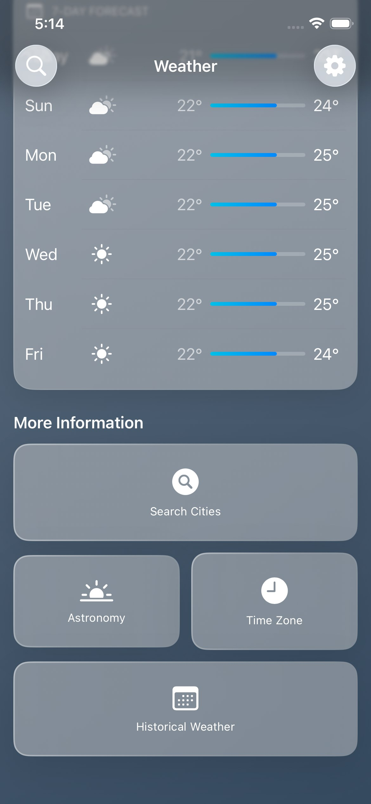
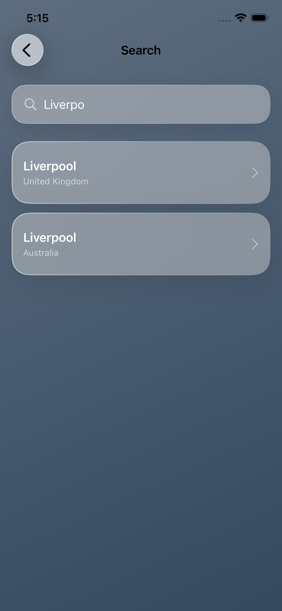
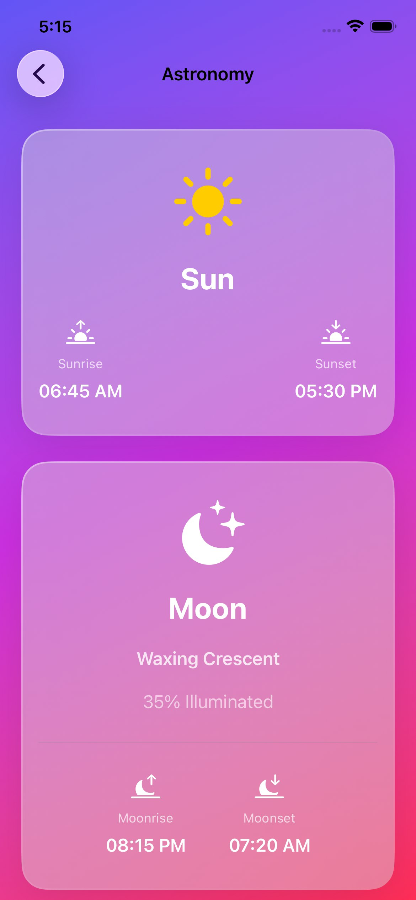
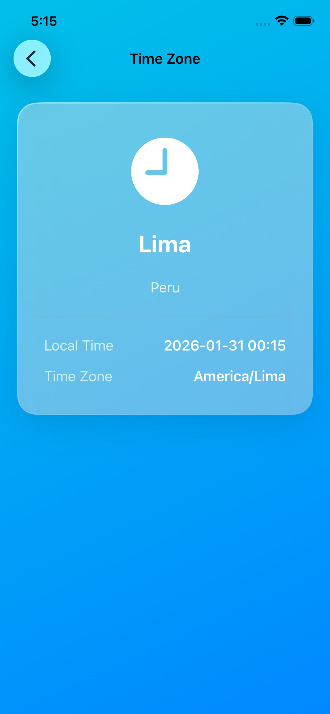
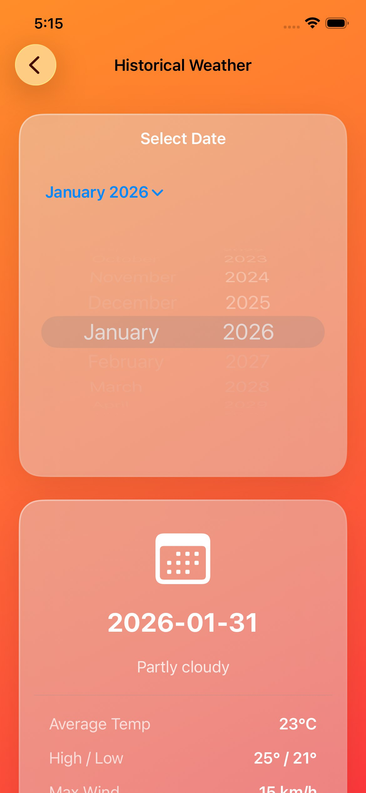
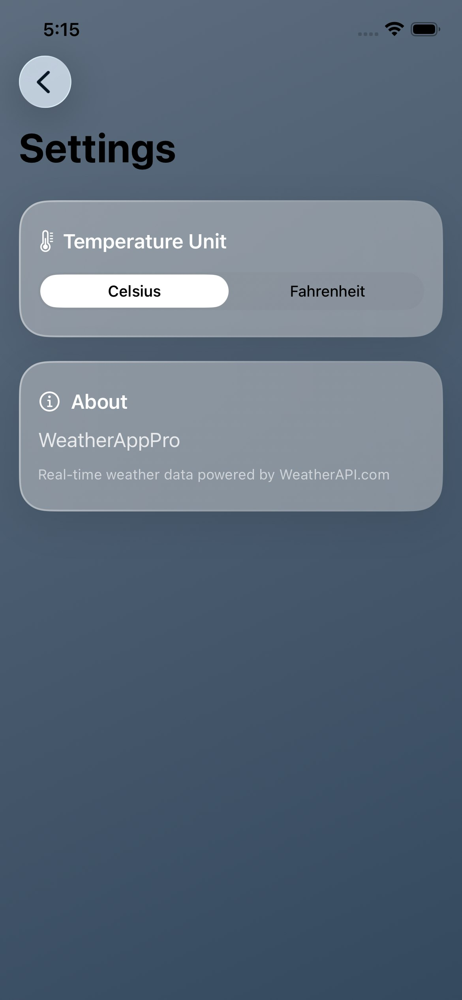

# WeatherAppPro 🌤️

A modern, feature-rich iOS weather application built with SwiftUI, featuring real-time weather data, beautiful glassmorphism UI, and comprehensive weather information.


---

## 📱 Screenshots

<p align="center">
  
  
  
</p>

<p align="center">
  
  
  
</p>

<p align="center">
  
</p>

---

## ✨ Features

### Core Weather Features
- 🌡️ **Real-time Weather Data** - Current temperature, feels like, humidity, wind speed
- 📅 **7-Day Forecast** - Daily high/low temperatures with conditions
- ⏰ **24-Hour Forecast** - Hourly temperature and weather predictions
- 🔍 **City Search** - Search for any city worldwide with autocomplete
- 🌐 **Location-based** - Automatic weather updates for selected locations

### Advanced Features
- 🌅 **Astronomy Data** - Sunrise, sunset, moonrise, moonset, and moon phases
- 🕐 **Time Zone Information** - Local time and timezone for any location
- 📊 **Historical Weather** - View past weather data with interactive date picker
- 🌡️ **Temperature Units** - Toggle between Celsius and Fahrenheit
- 🔄 **Pull to Refresh** - Easy data refresh with pull gesture

### Design & UX
- 💎 **Liquid Glass Design** - Modern glassmorphism UI with frosted glass effects
- 🎨 **Dynamic Backgrounds** - Gradient changes based on weather conditions
- 🌓 **Adaptive Icons** - Weather-specific SF Symbols icons
- ♿ **Accessibility** - Full VoiceOver support and dynamic type
- 🎯 **Clean Architecture** - MVVM pattern with proper separation of concerns

---

## 🛠️ Technologies Used

### Frameworks & APIs
- **SwiftUI** - Modern declarative UI framework
- **Combine** - Reactive programming for data flow
- **WeatherAPI.com** - Real-time weather data provider
- **URLSession** - Async/await networking
- **UserDefaults** - Persistent settings storage

### Architecture & Patterns
- **MVVM** (Model-View-ViewModel)
- **Router Pattern** - Type-safe navigation with NavigationStack
- **Repository Pattern** - Clean API abstraction
- **Dependency Injection** - Protocol-based services

### UI Components
- **Liquid Glass Cards** - Custom glassmorphism components
- **SF Symbols** - Native icon system
- **Custom Gradients** - Dynamic weather-based backgrounds
- **Material Effects** - Ultra-thin material backgrounds

---

## 📦 Installation

### Requirements
- macOS Sonoma 14.0+ (for Xcode 15+)
- Xcode 15.0+
- iOS 17.0+ deployment target
- Swift 5.9+

### Setup Steps

1. **Clone the repository**
```bash
git clone https://github.com/donnadony/WeatherAppPro.git
cd WeatherAppPro
```

2. **Get a free API key from WeatherAPI.com**
   - Visit [weatherapi.com/signup.aspx](https://www.weatherapi.com/signup.aspx)
   - Create a free account
   - Copy your API key from the dashboard

3. **Configure API key**
   - Copy the template file:
   ```bash
   cp WeatherAppPro/WeatherAppPro/Core/Network/APIConfig.swift.template \
      WeatherAppPro/WeatherAppPro/Core/Network/APIConfig.swift
   ```
   - Open `Core/Network/APIConfig.swift`
   - Replace `YOUR_API_KEY_HERE` with your actual key:
   ```swift
   static let weatherAPIKey = "your_api_key_here"
   ```

4. **Open in Xcode**
```bash
open WeatherAppPro/WeatherAppPro.xcodeproj
```

5. **Build and Run**
   - Select a simulator (iPhone 15 Pro recommended)
   - Press `⌘ + R` to build and run

---

## 🌐 API Configuration

### WeatherAPI.com

**Free Tier Includes:**
- ✅ 1,000,000 API calls per month
- ✅ Real-time weather data
- ✅ 14-day forecast
- ✅ Astronomy data
- ✅ Historical weather (limited)
- ✅ Search/autocomplete

**Endpoints Used:**
1. **Current + Forecast** - `/forecast.json?q={location}&days=7`
2. **Search** - `/search.json?q={query}`
3. **Astronomy** - `/astronomy.json?q={location}&dt={date}`
4. **Time Zone** - `/timezone.json?q={location}`
5. **History** - `/history.json?q={location}&dt={date}`

### API Key Security

⚠️ **Important:** Never commit your API key to version control!

The `.gitignore` file already includes `APIConfig.swift` to prevent accidental commits.

For production, consider using:
- Environment variables
- Secure storage (Keychain)
- Backend proxy

---

## 🏗️ Project Structure

```
WeatherAppPro/
├── Core/
│   ├── Network/           # API services and models
│   ├── Router/            # Navigation management
│   ├── Theme/             # UI components and theme
│   ├── Helpers/           # Utilities and mappers
│   └── Persistence/       # Data storage (future)
├── Features/
│   ├── Weather/           # Main weather screens
│   ├── Search/            # City search
│   ├── Settings/          # App settings
│   ├── Astronomy/         # Sun and moon data
│   ├── TimeZone/          # Time zone information
│   └── History/           # Historical weather
├── Extensions/            # Swift extensions
├── screenshots/           # App screenshots
└── ContentView.swift      # App entry point
```

---

## 🎨 Design System

### Liquid Glass UI

The app uses a custom **glassmorphism** design system inspired by Apple's Weather app:

**Key Features:**
- Frosted glass effect with `.ultraThinMaterial`
- Subtle gradient borders
- Dynamic blur backgrounds
- Depth with shadows

**Weather Gradients:**
- ☀️ **Sunny** - Yellow → Orange
- ☁️ **Cloudy** - Gray → Dark gray
- 🌧️ **Rainy** - Light blue → Dark blue
- ❄️ **Snowy** - Light cyan → Cyan
- ⛈️ **Stormy** - Dark gray → Black
- 🌫️ **Foggy** - Light gray → Gray

---

## 🔍 Key Features

### Weather Icon Mapping

Automatic icon selection based on weather conditions:

```swift
WeatherIconMapper.icon(for: "Light rain") 
// Returns: "cloud.drizzle.fill" 🌦️
```

**Supported Conditions:**
- Clear/Sunny → `sun.max.fill`
- Cloudy → `cloud.fill`
- Rain → `cloud.rain.fill`
- Snow → `cloud.snow.fill`
- Thunder → `cloud.bolt.rain.fill`
- Fog → `cloud.fog.fill`

### Temperature Conversion

Real-time Celsius ↔ Fahrenheit conversion with persistent settings:

```swift
settings.convert(22.0)  // Celsius: 22.0°C
settings.convert(22.0)  // Fahrenheit: 71.6°F
```

### Search with Debounce

Efficient city search with 0.5s debounce to minimize API calls:

```swift
$searchText
    .debounce(for: 0.5, scheduler: RunLoop.main)
    .removeDuplicates()
```

---

## 🚀 Future Enhancements

### Planned Features
- [ ] **Home Screen Widgets** - iOS 17 interactive widgets
- [ ] **Lock Screen Widgets** - Live Activities integration
- [ ] **Weather Alerts** - Push notifications for severe weather
- [ ] **Multiple Locations** - Save and manage favorite cities
- [ ] **Dark Mode** - System appearance support
- [ ] **Offline Mode** - Core Data caching
- [ ] **Weather Maps** - Radar and satellite imagery
- [ ] **Air Quality Index** - AQI data and alerts
- [ ] **iPad Support** - Adaptive layout
- [ ] **watchOS App** - Apple Watch companion
- [ ] **Siri Shortcuts** - Voice commands

### Technical Improvements
- [ ] Unit tests with XCTest
- [ ] UI tests
- [ ] CI/CD with GitHub Actions
- [ ] Localization (i18n)
- [ ] Accessibility audit
- [ ] Performance optimization

---

## 📄 License

This project is licensed under the MIT License - see the [LICENSE](LICENSE) file for details.

---

## 👤 Author

**Dony Mollo**
- GitHub: [@donnadony](https://github.com/donnadony)
- Email: dony.mollo11@gmail.com

---

## 🙏 Acknowledgments

- Weather data powered by [WeatherAPI.com](https://www.weatherapi.com/)
- Icons by [SF Symbols](https://developer.apple.com/sf-symbols/)
- Design inspired by [Apple Weather](https://apps.apple.com/app/weather/id1069513131)
- Built with ❤️ using SwiftUI

---

## 📞 Support

For setup help or questions:

1. Check the [Setup Guide](SETUP.md)
2. Read the [API Documentation](WeatherAppPro/WeatherAppPro/Core/Network/WEATHER_API_REFERENCE.md)
3. Open an issue on GitHub

---

**⭐ If you found this project helpful, please give it a star!**

Made with ☕ and SwiftUI
